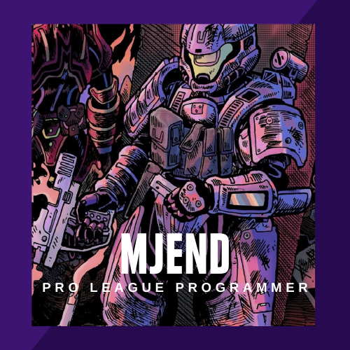

<h2 style="font-size:100px;" align="center">
  </img>
   
  MJEND
   
   
 </h2>

  
    
  

Hi, I am a programmer in school looking for some extra cash using my talent.
I have done many projects with HTML, CSS, JavaScript, SCSS, THREE.js, and animte.js.
I am looking to collab with people's projects, also Halo 2❤ is the best. 

- 📫 How to reach me you can dm me on discord @MJEND#8601 or at markuss.cowburn@gmail.com

